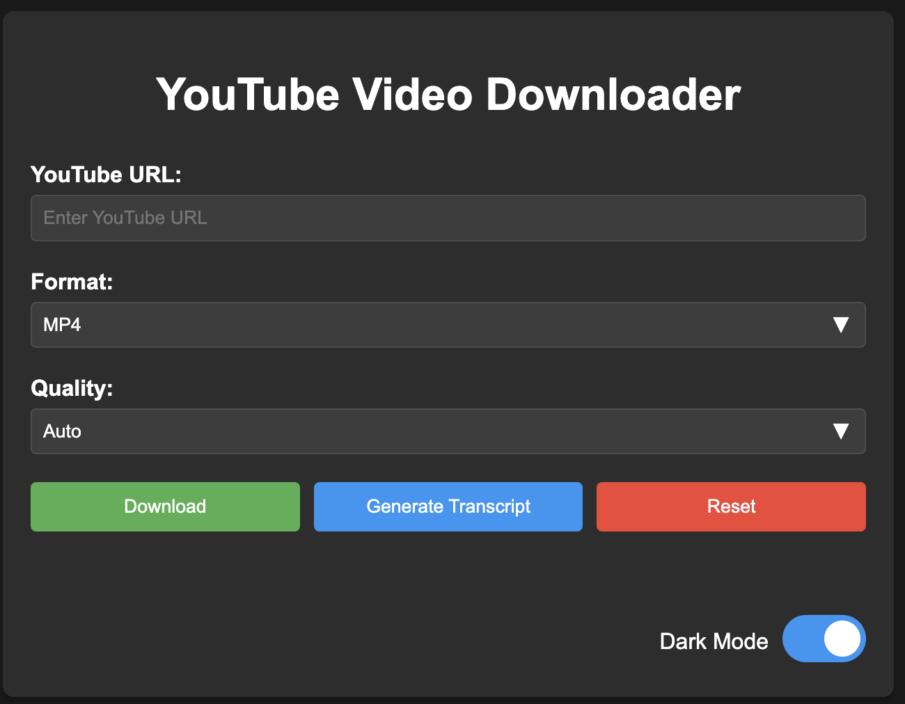

# YouTube Video Downloader

## Description
A versatile desktop application for downloading YouTube videos, extracting audio, and retrieving video transcripts. This Electron-based tool provides a comprehensive solution for content creators, researchers, and media enthusiasts.

## Screenshot

## Features
- Download full MP4 YouTube videos in multiple resolutions
- Extract mp3 audio from YouTube videos
- Copy video transcripts to clipboard
- Light and dark themes
- A reset button to clear all downloaded content
- Cross-platform desktop application
- Simple, intuitive user interface

## Prerequisites
- Node.js (version 14 or later)
- npm (Node Package Manager)

## Installation
1. Clone the repository
2. Run `npm install` to install dependencies

## Execution
There are two ways to run the application:

### Option 1: Using the Start Script
- Double-click `start.sh` (for macOS/Linux)
- Or run `./start.sh` in the terminal

### Option 2: Using npm
- Development mode: `npm run dev`
- Production mode: `npm start`

## Usage
1. Enter a YouTube video URL
2. Choose from available options:
   - Download full video
   - Extract audio only
   - Copy video transcript

## Architecture
The application is built using Electron and follows a two-process architecture:

### Main Process (`main.js`)
- Handles core application logic
- Creates and manages application windows
- Manages system-level interactions
- Coordinates video, audio, and transcript downloads

### Renderer Process (`renderer.js`)
- Manages user interface
- Handles user interactions
- Communicates download and transcript requests to main process

## Dependencies
- Electron
- youtube-transcript (for retrieving video transcripts)
- yt-dlp-exec (for video and audio downloads)
- ytdl-core
- fluent-ffmpeg (for audio extraction)

## Technologies
- JavaScript
- Electron
- HTML
- CSS

## License
ISC License
